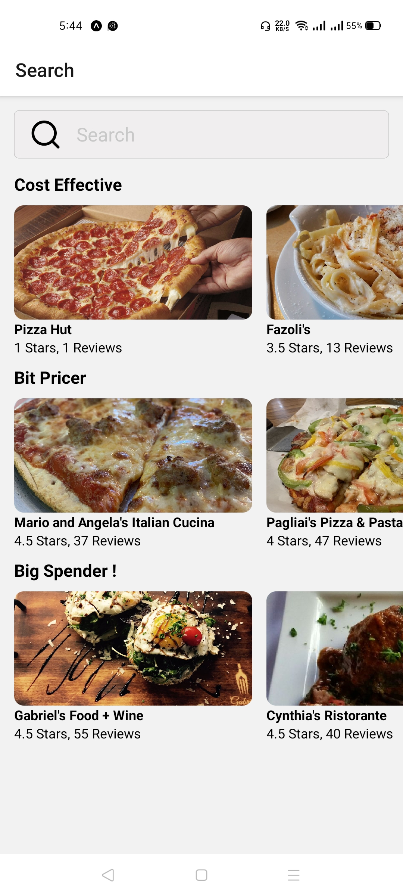
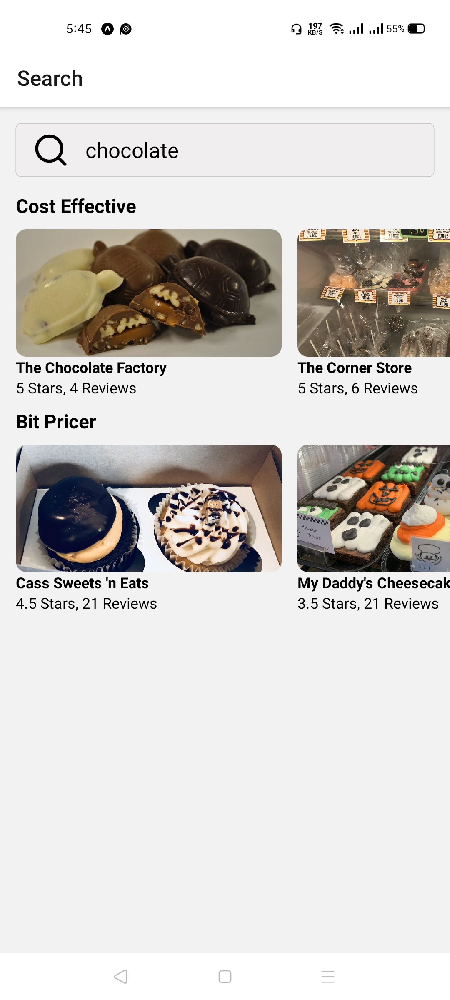
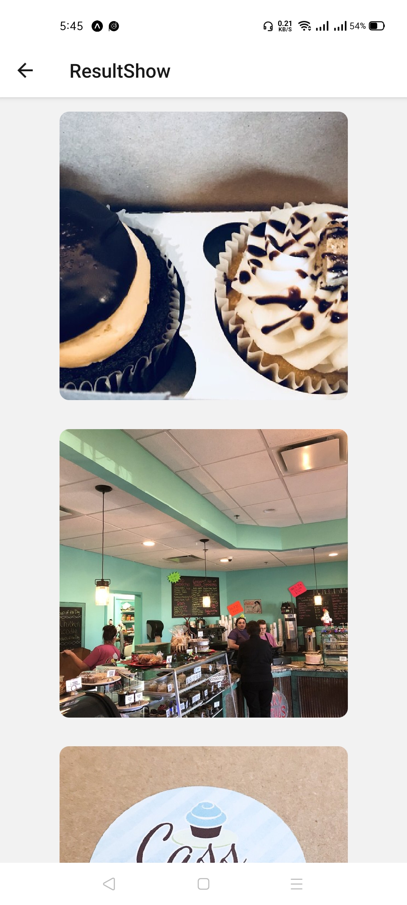

# Food

An application used to search restaurants by food name and read their informations. Restaurants are Visualized in good styled lists with ratings, number of ratings and images, Built with React Native, Api and JavaScript.

---
## Main technologies used
* [React Native](https://github.com/facebook/react-native)
> A framework for building native apps with React.
* [RESTful Api](https://searchapparchitecture.techtarget.com/definition/RESTful-API#:~:text=A%20RESTful%20API%20is%20an,to%20communicate%20with%20each%20other.)
> A RESTful API is an application program interface (API) that uses HTTP requests to GET, PUT, POST and DELETE data.
* [React Native Elements](https://github.com/react-native-elements/react-native-elements)
> Cross Platform React Native UI Toolkit.
* [React Native Victor Icons](https://oblador.github.io/react-native-vector-icons/)
> Customizable Icons for React Native with support for NavBar/TabBar, image source and full styling.
* [React Navigation](https://reactnavigation.org/)
> React Navigation provides a way for your app to transition between screens and manage navigation history.
---
## Installation and Setup Instructions
Clone down this repository. You will need `node` and `npm` installed globally on your machine.
 
Installation:
 
`npm install`
 

To Run Test Suite:
 
`npm test`
 

To Start Server:
 
`npm start`
 

To visit app:
 
`http://localhost:19002/`

---
## Reflection
This was a 3 day long project. Project goals included using technologies learned up until this point and familiarizing myself with documentation for new features.

Originally I wanted to build an application that allowed users to search different restaurants,showing their images and get feedback about them. I started this process by using the create-react-app boilerplate and setup axios.

One of the main challenges I ran into was how to fetch data using REST Api and how to display it efficiently. This lead me to spend a lot of time on a research, At the end i reached the soultion using Axios and Flatlist.

At the end of the day, the technologies implemented in this project are React, RESTful Api, and a significant amount of VanillaJS, JSX, and CSS. I chose to use the create-react-app boilerplate to minimize initial setup and invest more time in diving into weird technological rabbit holes. In the next iteration I plan on handrolling a webpack.config.js file to more fully understand the build process.

---
## Project Screen Shots

